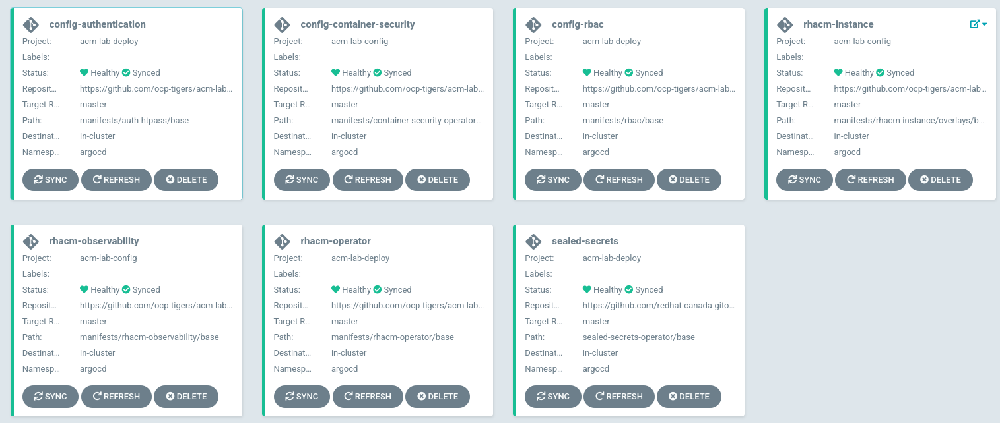
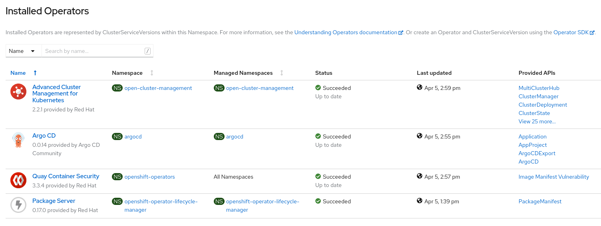

# RH ACM Deployment and Configuration 🧙

Repo to deploy and configure an RHACM lab using GitOps!

## Installation

There are two ways of install this lab, or step by step or in an automatic deployment using a all-in-one script.

NOTE: Fully working in AWS. In the future, other cloud providers will be added.

### Modes

* Basic: Install only RHACM with RBAC and Sealed Secrets. No Addons installed.
* Full: Install RHACM with Addons (Observability, CSO, OPA, etc)

### Automatic Deployment

* [Automatic Deployment](./assets/automaticdeploy.md)

### Step by Step

* [Step by Step Deployment](./assets/stepbystep.md)

## Usage:

After the installation, you will get all the elements of the lab installed using GitOps and Argocd:

You will have installed the following resources:

* ArgoCD
* Dex (for ArgoCD OAuth integration)
* OAuth Htpasswd Authentication
* OCP RBAC (Users and Groups)
* Sealed Secrets
* RHACM Operator
* RHACM MultiClusterHub
* RHACM Observability [full mode]
* Container Security Operator [full mode]

A quick look of the Operators installed is:

