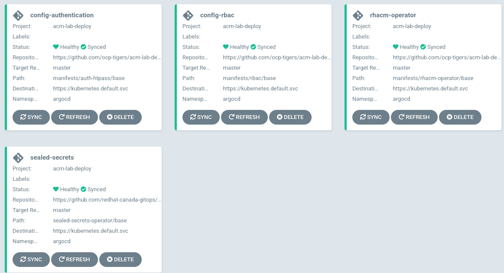

## Step by Step

### 1. Installing ArgoCD

```
until oc apply -k https://github.com/ocp-tigers/acm-lab-deploy/argocd/install; do sleep 2; done
```

This step will deploy the following resources for the demo:

* ArgoCD-Operator
* ArgoCD-Instance
* Dex (for OCP-OAuth)


To get your argocd route (where you can login)

```
oc get route argocd-server -n argocd -o jsonpath='{.spec.host}{"\n"}'
```

### 2. Deploying the ACM Lab Resources

```
oc apply -k https://github.com/ocp-tigers/acm-lab-deploy/acm-lab-deploy/config/overlays/default
```

This step will deploy the following resources for the demo:

* Sealed-secrets
* OAuth (htpass)
* RBAC
* RHACM-Operator



### 3. Apply the Sealed Secrets Key

For avoid that the Sealed Secrets generates an internal PKI, you need to provide the sealed-tls.crt/key  pairs. Obviously for security purposes the private key is not in this repo :)

Bring your own certs and exported from here:

```
export PRIVATEKEY_SEALED="assets/sealed-tls.key"
export PUBLICKEY_SEALED="assets/sealed-tls.crt"
export NS_SEALED_SEALED="kube-system"
export SECRETNAME_SEALED="sealedkeys"

oc delete secret -n $NS_SEALED_SEALED -l sealedsecrets.bitnami.com/sealed-secrets-key
oc -n "$NS_SEALED_SEALED" create secret tls "$SECRETNAME_SEALED" --cert="$PUBLICKEY_SEALED" --key="$PRIVATEKEY_SEALED"
oc -n "$NS_SEALED_SEALED" label secret "$SECRETNAME_SEALED" sealedsecrets.bitnami.com/sealed-secrets-key=active
sleep 10
```

### 4. Set the AWS Cloud Credentials

```
export AWS_ACCESS_KEY=$(oc get secret aws-creds -n kube-system -o jsonpath='{.data.aws_access_key_id}')
export AWS_SECRET_KEY=$(oc get secret aws-creds -n kube-system -o=jsonpath='{.data.aws_secret_access_key}')
```

```
export AWS_ACCESS_KEY_ID=$(echo $AWS_ACCESS_KEY | base64 -d)
export AWS_SECRET_ACCESS_KEY=$(echo $AWS_SECRET_KEY | base64 -d)
```

```
export AWS_DEFAULT_REGION=eu-west-1
```

### 5. Configure the bucket for Observability

Generate the Thanos Bucket for the Observability in RHACM:

```
aws s3api create-bucket --bucket obs-thanos --region $AWS_DEFAULT_REGION --create-bucket-configuration LocationConstraint=$AWS_DEFAULT_REGION
export S3_BUCKET="obs-thanos"
export S3_ENDPOINT="s3.$AWS_DEFAULT_REGION.amazonaws.com"
```

Then add the obs-secret as SealedSecret in the proper manifest folder:

```
envsubst < assets/obs-secret.yaml.tpl > assets/obs-secret.yaml
kubeseal --cert "${PUBLICKEY_SEALED}" -o yaml --scope cluster-wide < assets/obs-secret.yaml > manifests/rhacm-observability/base/obs-secret.yaml
```

Do the changes in the gitOps way:

```
git commit -am "added new obs bucket"
git push
```

### 6. Configure the letsencrypt Certificates

Add the AWS creds into the cloud dns credentials file and sealed with Sealed Secrets:

```
envsubst < assets/cloud-dns-credentials.yaml.tpl > assets/cloud-dns-credentials.yaml
kubeseal --cert "${PUBLICKEY_SEALED}" -o yaml --scope cluster-wide < assets/cloud-dns-credentials.yaml > manifests/letsencrypt-certs/base/cloud-dns-credentials.yaml
```

Do the changes in the gitOps way:

```
git commit -am "added new cloud dns credentials"
git push
```

### 7. Configure the ACM Lab Resources

```
oc apply -k https://github.com/ocp-tigers/acm-lab-deploy/acm-lab-config/config/overlays/default
```


